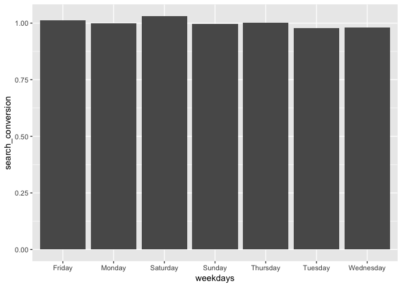
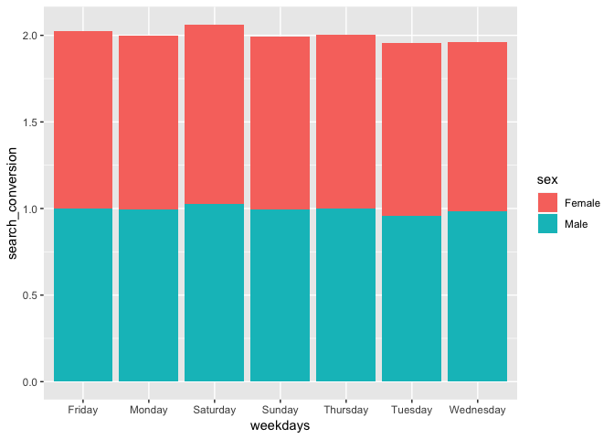
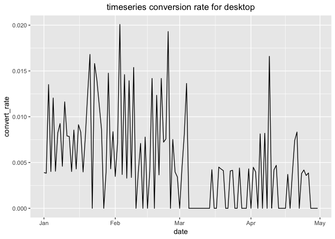
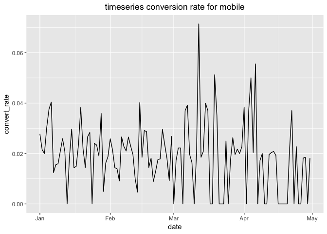

Funnel\_Analysis
================
Kaidi
17/01/2019

Description of the problem
--------------------------

This is the report to perform funnel analysis for en e commerce website. This E-commerce website has 4 step to convert customer to buy product.

1.  Convert customer to home page from login

2.  Convert customer from home page to search page

3.  Convert customer from search results to the product detail page

4.  Convert customer from product detail page to the payment confirmation page. So customers are converted to purchase product at this page

I was given a set of sales data and was asked to investigate whether there is something wrong with the conversion funnel and provide suggestions to improve the conversion funnel.

Importing data
--------------

Imporint csv files into R environment. The dataset contain data user information and the page that users were converted to. For example as below,

``` r
library(dplyr)
library(ggplot2)
```

    ##   user_id       date  device    sex
    ## 1  450007 2015-02-28 Desktop Female
    ## 2  756838 2015-01-13 Desktop   Male
    ## 3  568983 2015-04-09 Desktop   Male
    ## 4  190794 2015-02-18 Desktop Female
    ## 5  537909 2015-01-15 Desktop   Male
    ## 6  993454 2015-03-03 Desktop   Male

    ##   user_id        page
    ## 1   15866 search_page
    ## 2  347058 search_page
    ## 3  577020 search_page
    ## 4  780347 search_page
    ## 5  383739 search_page
    ## 6  383371 search_page

Joining different tables to get all information in one piece and converting pages to binary flag.

``` r
funnel <- user_table %>% left_join(home_page,by = "user_id") %>% left_join(search_page,by="user_id") %>% left_join(payment_confirmation,by = "user_id") %>% left_join(payment_confirmation,by = "user_id")

funnel$home_page <- as.numeric(!is.na(funnel$page.x))
funnel$search_page <- as.numeric(!is.na(funnel$page.y))
funnel$payment_page <- as.numeric(!is.na(funnel$page.x.x))
funnel$payment_confirmation <- as.numeric(!is.na(funnel$page.y.y))

funnel <- funnel[,-c(5,6,7,8)]
head(funnel)
```

    ##   user_id       date  device    sex home_page search_page payment_page
    ## 1  450007 2015-02-28 Desktop Female         1           0            0
    ## 2  756838 2015-01-13 Desktop   Male         1           0            0
    ## 3  568983 2015-04-09 Desktop   Male         1           1            0
    ## 4  190794 2015-02-18 Desktop Female         1           1            0
    ## 5  537909 2015-01-15 Desktop   Male         1           0            0
    ## 6  993454 2015-03-03 Desktop   Male         1           0            0
    ##   payment_confirmation
    ## 1                    0
    ## 2                    0
    ## 3                    0
    ## 4                    0
    ## 5                    0
    ## 6                    0

Now, checking the overall conversion rate

``` r
funnel %>% group_by(device) %>% summarise(home = sum(home_page)/length(user_id),search = sum(search_page)/sum(home_page), product = sum(payment_page)/sum(search_page), payment = sum(payment_confirmation)/sum(payment_confirmation))
```

    ## # A tibble: 2 x 5
    ##   device   home search product payment
    ##   <fct>   <dbl>  <dbl>   <dbl>   <dbl>
    ## 1 Desktop     1    0.5 0.00498       1
    ## 2 Mobile      1    0.5 0.02          1

``` r
funnel %>% group_by(device,sex) %>% summarise(home = sum(home_page)/length(user_id),search = sum(search_page)/sum(home_page), product = sum(payment_page)/sum(search_page), payment = sum(payment_confirmation)/sum(payment_confirmation))
```

    ## # A tibble: 4 x 6
    ## # Groups:   device [?]
    ##   device  sex     home search product payment
    ##   <fct>   <fct>  <dbl>  <dbl>   <dbl>   <dbl>
    ## 1 Desktop Female     1  0.503 0.00490       1
    ## 2 Desktop Male       1  0.497 0.00506       1
    ## 3 Mobile  Female     1  0.503 0.0220        1
    ## 4 Mobile  Male       1  0.497 0.0180        1

From the conversion rate statistics, the conversion from new user to home page is 100% which is no surprise as most website will propmt you to home page after users registered. The conversion from home page to a search page is all around 50% for desktop and mobile. The differences is in converting customers from search result page to product detail page. Lets check the number of people were on search page and the number of people were converted to product detail page. The resutls are shown below,

``` r
funnel %>% group_by(device) %>% summarise(search = sum(search_page),product = sum(payment_page))
```

    ## # A tibble: 2 x 3
    ##   device  search product
    ##   <fct>    <dbl>   <dbl>
    ## 1 Desktop  30100     150
    ## 2 Mobile   15100     302

``` r
prop.test(x=c(150,302),n=c(30100,15100))
```

    ## 
    ##  2-sample test for equality of proportions with continuity
    ##  correction
    ## 
    ## data:  c(150, 302) out of c(30100, 15100)
    ## X-squared = 227.53, df = 1, p-value < 2.2e-16
    ## alternative hypothesis: two.sided
    ## 95 percent confidence interval:
    ##  -0.01743680 -0.01259643
    ## sample estimates:
    ##      prop 1      prop 2 
    ## 0.004983389 0.020000000

Comparing with the mobile platform, we can see it visually that there are more people stayed at the search page and less people converted to product detail page on desktop. The mobile platform has a lot better conversion rate with less people stayed on the search page. The statistical z test also verifies that the conversion rate of search pages are significantly different between desktop and mobile platform. This is very strange. There might be some events going on during the weekdays or weekends that affect the conversion rate on desktop. To investigate more, let's transform the data a bit,

``` r
#convert date into weekdays and investigate in there are variation on different weekdays.
user_table$date <- as.Date(user_table$date)
user_table$weekdays <- weekdays(user_table$date)
user_table$weekdays <- as.factor(user_table$weekdays )

funnel_week <- user_table %>% left_join(home_page,by = "user_id") %>% left_join(search_page,by="user_id") %>% left_join(payment_confirmation,by = "user_id") %>% left_join(payment_confirmation,by = "user_id")

funnel_week$home_page <- as.numeric(!is.na(funnel_week$page.x))
funnel_week$search_page <- as.numeric(!is.na(funnel_week$page.y))
funnel_week$payment_page <- as.numeric(!is.na(funnel_week$page.x.x))
funnel_week$payment_confirmation <- as.numeric(!is.na(funnel_week$page.y.y))

funnel_week <- funnel_week[,-c(6,7,8,9)]

funnel_week_specific <- funnel_week %>% group_by(device,weekdays) %>% summarise(home_page_conversion = sum(home_page)/length(user_id),search_conversion = sum(search_page)/sum(home_page), product_page_conversion = sum(payment_page)/sum(search_page), payment_conversion = sum(payment_confirmation)/sum(payment_confirmation))

funnel_week_sex <- funnel_week %>% group_by(device,sex,weekdays) %>% summarise(home_page_conversion = sum(home_page)/length(user_id),search_conversion = sum(search_page)/sum(home_page), product_page_conversion = sum(payment_page)/sum(search_page), payment_conversion = sum(payment_confirmation)/sum(payment_confirmation))

ggplot(data = funnel_week_specific,aes(x = weekdays, y = search_conversion)) + geom_bar(stat = 'identity')
```



From the plot above, there is no huge variation for overall conversion rate. Same gose to the conversion rate between sex below,

``` r
ggplot(data = funnel_week_sex,aes(x = weekdays, y = search_conversion)) + geom_bar(aes(fill = sex), stat = 'identity')
```



Looking at the time series data of conversion rate of desktop and mobile platform to see if there is trand for conversion rate to increase or decrease.

``` r
funnel$date <- as.Date(funnel$date)
funnel_alldevice <- funnel %>% group_by(device,date) %>% summarise(total_user_on_the_day = sum(search_page), total_user_converted = sum(payment_page),convert_rate=sum(payment_page)/sum(search_page))
funnel_desktop <- funnel_alldevice[funnel_alldevice$device=='Desktop',] 
funnel_mobile <- funnel_alldevice[funnel_alldevice$device=='Mobile',]
ggplot(data = funnel_desktop,aes(x=date,y=convert_rate)) + geom_line() + ggtitle("timeseries conversion rate for desktop")+theme(plot.title = element_text(hjust = 0.5))
```



``` r
ggplot(data = funnel_mobile,aes(x=date,y=convert_rate)) + geom_line() + ggtitle("timeseries conversion rate for mobile")+theme(plot.title = element_text(hjust = 0.5))
```

 The conversion rate variation didn't show clear trend. The above plots all suggest that there is no events happening that affect the conversion rate. Hence the huge difference of conversion rate between desktop and mobile could be the difference search experience that user had. Perhaps, the search algorithm on desktop didn't return the correct results that users are searching for. And as the result, less users drill into the product detail pages. My suggestion is to talk to the developers and product managers from desktop platform and workout the specific reason why the search experience is not great.
